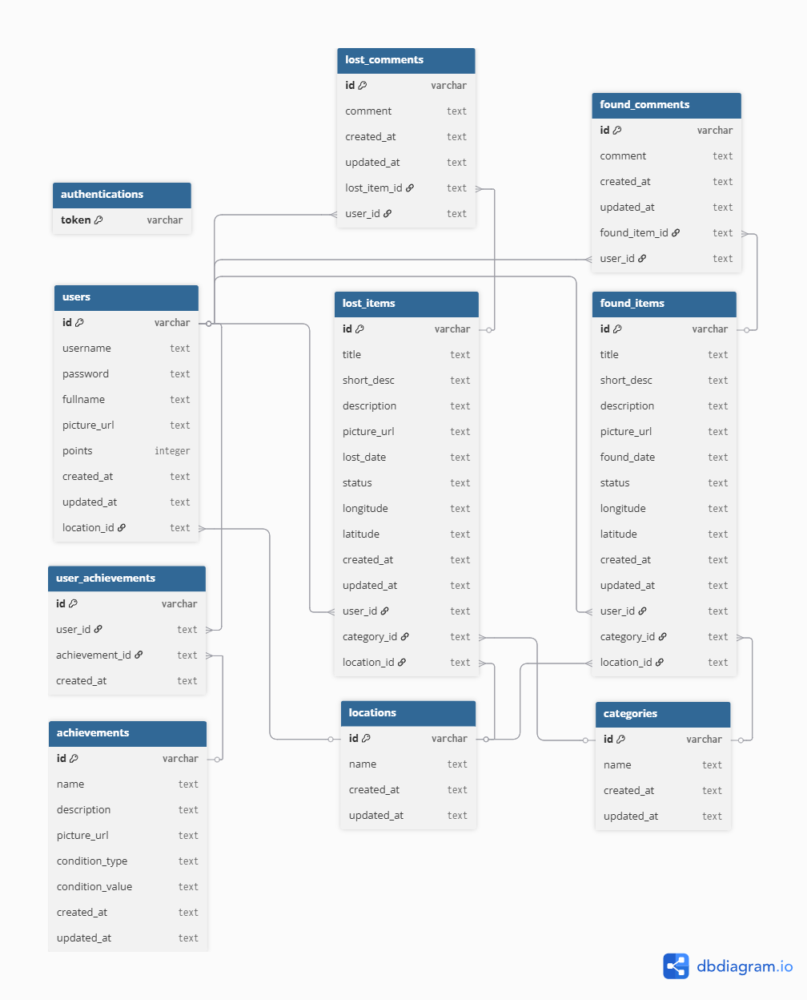

# 🔎 Ketemukan-BE

---

## 📑 Daftar Isi

- [🔎 Ketemukan-BE](#-ketemukan-be)
  - [📑 Daftar Isi](#-daftar-isi)
  - [🚀 Fitur Utama](#-fitur-utama)
  - [🧮 Formula Point](#-formula-point)
  - [🧮 Formula Achievement](#-formula-achievement)
  - [🗃️ ERD / Struktur Tabel](#️-erd--struktur-tabel)
  - [🌐 API Base URL / Deployment](#-api-base-url--deployment)
  - [📖 API Documentation](#-api-documentation)
  - [📁 Struktur Folder](#-struktur-folder)

---

## 🚀 Fitur Utama

- Login/Register User
- Kelola User (update profile user)
- Post barang hilang atau barang ditemukan
- Lihat, cari, filter barang hilang atau barang ditemukan
- Lihat informasi detail dari item yang telah dipost
- Kelola item yang telah dipost (update/delete item)
- Berikan komentar atau informasi pada item yang telah dipost
- Raih point dan achievement dari post item atau komentar

## 🧮 Formula Point

- Setiap user yang mempost barang ditemukan akan mendapatkan 50 point
- Setiap user yang mempost barang hilang akan mendapatkan 20 point
- Setiap user yang berkomentar pada detail item akan mendapatkan 10 point

## 🧮 Formula Achievement

<details>
<summary>Formula achievement (click me)</summary>

| No  | Name                | Description                                                             | Condition Type | Condition Value |
| --- | ------------------- | ----------------------------------------------------------------------- | -------------- | --------------- |
| 1   | Bounty Hunter       | Kamu sudah berhasil menemukan 10 barang — pencarianmu dimulai!          | found_items    | 10              |
| 2   | Sharp Eye           | Matamu tajam! Kamu berhasil menemukan 20 barang.                        | found_items    | 20              |
| 3   | Tracking Master     | Kamu adalah ahli dalam menemukan barang — 50 pencapaian hebat!          | found_items    | 50              |
| 4   | Legend of the Found | Kamu adalah legenda di dunia barang hilang. Tak tertandingi.            | found_items    | 100             |
| 5   | Where Is It?        | "Loh, ilang lagi?" — kayaknya kamu kurang update sama barang sendiri 😅 | lost_items     | 5               |
| 6   | The Forgetful       | Kamu dan barangmu tampaknya sering beda jalan. Hati-hati, ya!           | lost_items     | 10              |
| 7   | Lost Master         | Saat orang lain kehilangan kunci, kamu kehilangan satu kota.            | lost_items     | 20              |
| 8   | Help me!            | Kamu perlu GPS buat hidupmu sendiri. 100 kali kehilangan, serius? 😭    | lost_items     | 100             |
| 9   | Helpful Citizen     | Baru 5 komentar, tapi udah mulai peduli. Warga yang layak dicontoh 👍   | comments       | 5               |
| 10  | Quick Responder     | Gak perlu disuruh, langsung bantu jawab. Mantap!                        | comments       | 10              |
| 11  | Lost & Found Friend | Kamu selalu hadir waktu orang lain kehilangan. Baik banget sih 😢       | comments       | 20              |
| 12  | Comment Champion    | Kamu udah kayak admin, tapi tanpa gaji. Tetap setia bantuin! 🫡          | comments       | 50              |
| 13  | Keyboard Hero       | Menolong tanpa jubah, cuma modal keyboard dan niat baik 💻              | comments       | 75              |
| 14  | Golden Citizen      | Kamu layak dikasih penghargaan RT. Seratus komentar penuh empati 🥇     | comments       | 100             |

</details>

## 🗃️ ERD / Struktur Tabel

<details>
<summary>ERD (click me)</summary>



</details>

## 🌐 API Base URL / Deployment

Deployment menggunakan [railway](https://railway.com/) free tier

| Base URL                                             | Owner                                         | Status                      |
| ---------------------------------------------------- | --------------------------------------------- | --------------------------- |
| https://ketemukan-be-production-7e9f.up.railway.app/ | [husenmalik8](https://github.com/husenmalik8) | Died 😵                     |
| https://ketemukan-be-production.up.railway.app/      | [husenmalik9](https://github.com/husenmalik9) | Active 🙂 (Until 25 August) |

## 📖 API Documentation

[Postman](https://documenter.getpostman.com/view/9925894/2sB3B8tDZV)

## 📁 Struktur Folder

```bash
src/
├── controllers/
├── models/
├── routes/
└── ...
```
